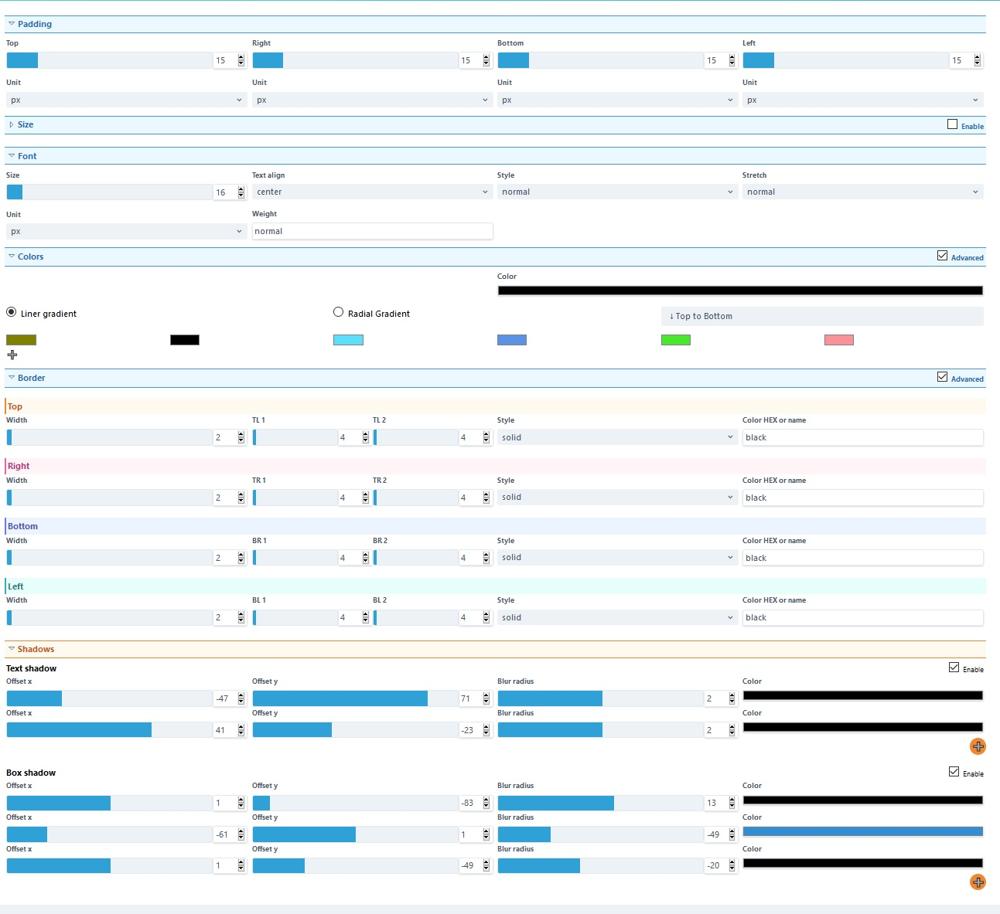
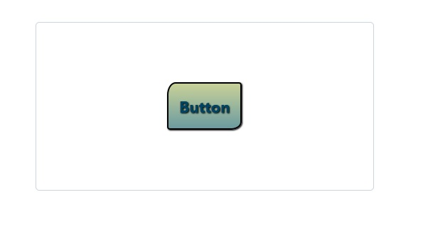

## CSS button generator

### Single page button generator

build with vue.js and tailwindcss

You can set every possible css rule for buton there is.

Pick between basic and advanced settings for border and colors.

You can copy your own style and use it on your own page.

Your last created buttons are saved to your local storage in broser, and you can return to them, until you delete your cache.

Use scroll button in number inputs

### Settings

### Output

